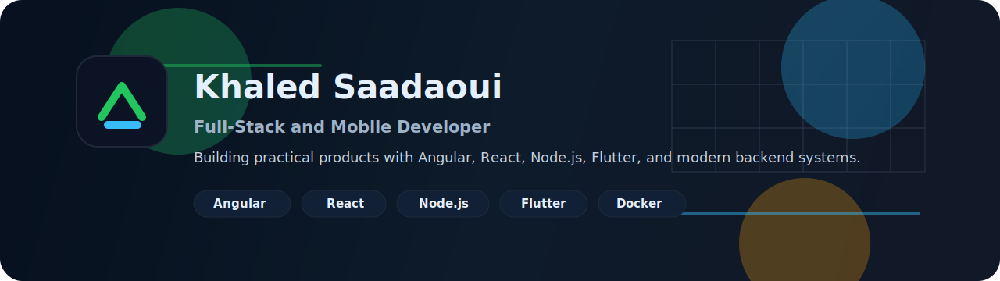

  

<h1 align="center">Khaled Saadaoui</h1>

<b>Full-Stack &amp; Mobile Engineer</b> · 3+ years shipping production web platforms &amp; cross-platform apps

Open to full-time &amp; contract roles across Germany &amp; the EU — remote or relocating

  
  
  

---

### 🔎 Recruiter snapshot (10s read)

| | |
|---|---|
| **Role** | Full-Stack &amp; Mobile Engineer — React, Angular, Node.js, Flutter |
| **Location** | Germany &amp; EU (actively applying / open to relocation) |
| **Availability** | Full-time &amp; contract |
| **Languages** | English (fluent) · French (fluent) · Arabic (native) · German (learning) |

---

### 🛠️ Core stack

  
  
  
  
  
  
  
  
  
  
  

I build production-ready single-page web apps, backend services, and cross-platform mobile apps — with an emphasis on clean architecture, testing, and maintainability.

---

### 🚀 Selected projects

<table>
<tr>
<td width="50%" valign="top">

**🎓 PFE — German Language Learning App** *(Flagship)*
Cross-platform mobile app with a backend, voice tutoring, adaptive practice, and multi-language content.
`Flutter` `TypeScript` `Express` `PostgreSQL`
🔗 [Repo](https://github.com/MBB2/PFE)

</td>
<td width="50%" valign="top">

**🌐 Portfolio** — Personal Website *(Live)*
Professional portfolio with project demos, deployed on GitHub Pages.
`HTML/CSS` `JS`
🔗 [Live site](https://mbb2.github.io/portfolio/) · [Repo](https://github.com/MBB2/portfolio)

</td>
</tr>
<tr>
<td width="50%" valign="top">

**📚 Ebook / ebookApp** — Cross-platform E-book Reader
Offline reading, local persistence, reusable UI components.
`React Native` `Expo` `SQLite`
🔗 [Repo 1](https://github.com/MBB2/Ebook) · [Repo 2](https://github.com/MBB2/ebookApp)

</td>
<td width="50%" valign="top">

**🍽️ GestionFormation** — Training &amp; QR Menu System
Full-stack platform with role-based access and a realtime UI.
`React` `Express` `MySQL`
🔗 [Repo](https://github.com/MBB2/GestionFormation)

</td>
</tr>
<tr>
<td colspan="2" valign="top">

**📱 NewsApplication / Task_Manager / sensorapp** — Android / Java projects
Mobile prototypes and coursework demonstrating native Android skills.
🔗 [NewsApplication](https://github.com/MBB2/NewsApplication) · [Task_Manager](https://github.com/MBB2/Task_Manager) · [sensorapp](https://github.com/MBB2/sensorapp)

</td>
</tr>
</table>

---

### ✅ How I make code production-ready

- Clear README and setup instructions for every repo
- Environment &amp; deployment notes (Docker / Docker Compose where applicable)
- Automated tests (unit &amp; e2e) and CI workflows where present
- Architecture notes and module boundaries documented (`ARCHITECTURE.md`)
- Meaningful commit messages and small, reviewable PRs

**How to evaluate my work — recommended quick checks:**
1. Open the project README — it should explain how to run locally and list core dependencies
2. Check `src/` for clear folder separation (`components` / `services` / `api` / `models`)
3. Look for tests (`spec`, `__tests__`) and CI configuration (`.github/workflows`)
4. Review architecture docs or inline module READMEs for design decisions

---

### 📈 GitHub stats

  
  

---

### 🎯 What I'm looking for

Engineering roles in backend, frontend, full-stack, or mobile — ideally with teams that value product focus, testing, and mentorship. Open to remote and Europe-based roles.

---

### 📬 Contact

- 🌐 Portfolio: [mbb2.github.io/portfolio](https://mbb2.github.io/portfolio/)
- 💼 LinkedIn: [linkedin.com/in/khaled-saadaoui](https://linkedin.com/in/khaled-saadaoui/)
- ✉️ Email: [khaled2182002@gmail.com](mailto:khaled2182002@gmail.com)

<i>Profile last updated: July 2026 — actively looking for opportunities in Germany &amp; Europe.</i>

